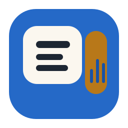

<p align="center">
  
</p>


# WeChat Auto Shell

一个面向 Windows 的微信预览监听桌面壳。它做的事很单一：盯住微信左侧会话列表，把最新预览整理到独立界面里，并按需接翻译和朗读。

它不是聊天机器人，也不是“完整聊天记录抓取器”。它不发消息、不自动回复、不写输入框，也不读取右侧聊天区全文。

## 它适合谁

- 想低打扰跟踪微信群或私聊最新动静的人
- 想把英文或中英混合消息顺手翻译成可读文本的人
- 想在 Windows 上单独看状态、消息预览和日志的人
- 想要一个不改微信客户端的监听方案的人

## 你会得到什么

- 监听微信左侧可见会话预览，自动提取最新变化
- 在本地桌面壳里查看会话列表、消息卡片、运行状态和健康信息
- 按需接入翻译服务，把外语消息转换成更容易读的文本
- 按需接入朗读能力，让消息可以直接播出来
- 单实例桌面壳，重复启动只聚焦已有窗口

## 你需要先接受的限制

- 当前抓的是左侧会话预览，不是右侧聊天区全文
- 长消息会被微信预览截断，后半段拿不回来
- 当前只覆盖左侧可见会话，看不见的会话本轮抓不到
- 这套方案适合低干扰浏览、翻译、朗读，不适合完整审计或归档
- 不提供发送消息、发送文件、自动回复、写输入框等主动操作

## 普通用户怎么理解它

- 如果你拿到的是安装包或现成的桌面应用，直接运行即可
- 仓库跟踪的默认配置以“首启可进入设置页”为目标，不把翻译或云 TTS 密钥当成硬依赖
- 只有当你主动启用额外翻译服务或云端朗读服务时，才需要额外补 URL 或凭据
- 运行时配置、日志和锁文件会落到 `%LOCALAPPDATA%\com.wechatauto.shell`

## 开发启动方式

如果你是直接跑仓库源码，先区分你要测的是网页端开发页，还是 Tauri 桌面壳。

前提：

- 安装 Python 依赖：`pip install -r requirements.txt`
- 安装前端依赖：`cd desktop-shell && npm install`
- 如果要跑 Tauri，再额外装好 `cargo` / `rustc`

### 1. 网页端开发页

网页端只负责前端界面，本身不会自动拉起 Python backend。
所以要开两个终端：

终端 1：

```bash
python listener_app/backend_main.py --config ".\config\listener.json"
```

终端 2：

```bash
cd desktop-shell
npm run dev
```

默认地址：

- HTTP：`http://127.0.0.1:8765`
- WebSocket：`ws://127.0.0.1:8766/events`

### 2. 直接测 Tauri 桌面壳

```bash
cd desktop-shell
npm run tauri dev
```

这条命令会先自动构建 sidecar，然后由 Tauri 壳自己托管 backend。
这种模式下不要再手工先跑一份 `python listener_app/backend_main.py`，否则容易制造双实例和配置混淆。

### 3. 安装包 / 打包后的桌面壳

- 安装包、`wechat-auto-shell.exe` 和 `npm run tauri dev` 都属于 Tauri 壳路径
- 运行时配置默认落在 `%LOCALAPPDATA%\com.wechatauto.shell`

### 4. 源码态和 Tauri 壳别混

- 源码态 `python listener_app/backend_main.py` 默认读取仓库里的 `config/listener.json`
- Tauri 壳优先读取 `%LOCALAPPDATA%\com.wechatauto.shell\config\listener.json`

这两套配置目录不会自动同步。
如果你改了仓库里的配置，却用的是 Tauri 壳，那实际生效的可能不是同一份文件。

## 文档分流

- 普通用户：看这份 `README.md` 就够了
- 开发者 / 维护者：看 [docs/developer-guide.md](./docs/developer-guide.md)

## 协议

MIT License
